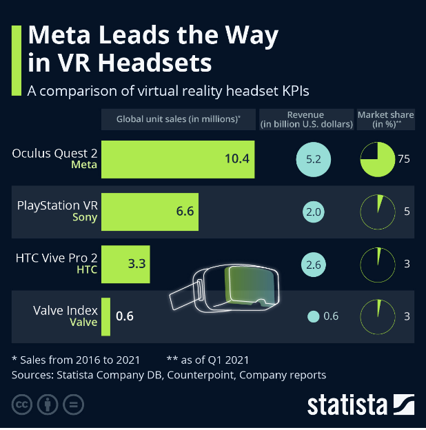

# The P.R.I.S.M (Player Responsive Interactive Sensory Matrix)
---
## 1. Executive Summary (Overview)

  The application of The PRISM is software that connects speakers and lighting with in-game aspects. This would include changing sound and lighting specs based on the current game and situation the player is in.. For example, in a cave scene in Minecraft, there would be more echo for the speakers and darker lighting, which is all controlled via bluetooth with the software. To be specific, it wouldn’t be all that different than a regular bluetooth speaker or lighting system, just run through another layer of code to make the changes detailed in Part 3.

  The target audience of our product is teens and young adults who enjoy playing video games. Since our product is focused towards gaming, the main demographic of video gaming is teens to young adults.

  The key problem that our product solves is the full immersion into the world of a video game is blocked partially by outside aspects or distractions. Our product serves as the protection from these many distractions and keeps you within the world that you chose to be in.

  The key features that our product provides are speakers that are connected to the system, which controls all sound coming from the game itself. The speakers would be set up similar to surround-sound, but reactive to the video game world. The lighting works in a similar way, as the lights are connected to the system, and emit the correct amount of lighting and coloring if needed. All of this connected, the immersion into the game will be better than everything before it.

---
## 2. Market Research and Need Analysis

   Currently, in the market, there are already  many technologies that make the gaming experience of the user rich, such as VR headsets from Apple, Meta, dual sense controllers from PlayStation, affluent sound effects and graphics successful game companies offer. From the products that are contemporary in the market or being developed, ‘Immersive Gamebox’ and ‘Gaming Pod’ have the most akin vision to what we are aiming to achieve - creating a gaming environment that the users can fully access and making another step towards the future of gaming technology.

  ‘Immersive Gamebox’ allows players to use their bodies as controllers and navigate through various digital adventures. It features tracking dots that connect with computers to determine where a user is in the room. By also implementing a high-quality projection system, it encourages players to touch screen walls to interact, and the sound system it implements that surrounds the environment makes the player feel as if they are literally in that setting. Offering various retro arcade games and newly designed game options, it conjures an inclusive environment for players of a wide range of ages.

  ‘Gaming Pod’ from Cooler Master, named Orb X, is currently in the process of development, but the experience it provides is promising and enthralling. It is also referred to as the ‘gaming throne’, which has a setup that comprises a mechanized chair, PC battlestation, one 34-inch display or up to three of the best 27-inch monitors of consumers’ choice, and a built-in 2.1 surround sound speakers. Cooler Master pitches the Orb X as a place “where luxury meets technology”.

 However, we are trying to present an approach that both of these products aren’t addressing - maximizing user’s gaming experience employing  minimalized equipment. As one of the major factors of consumers’ inclination to buy a product is the cost of the overall product, our team aims to reduce the burden posed to consumers compared to the ‘Gaming Pod’, which is overly expensive for most people to afford, and to the ‘Immersive Gamebox’, which is similar to the features we provide, but they charge more if accumulated, when our system paid once can give countless of experiences. Also our team’s product seeks for constant improvement, by making our product’s software as open source code, which can accommodate the sheer enjoyment of video games all over the world through lighting and sound.

The demand for advanced immersive gaming technology could be checked by comparing market success of Meta Quest and Immersive Game Box. Overall, Meta Quest is seen as a considerable success compared to Immersive Game Box, due to its well-known brand, strong content ecosystem, and affordability. As shown in the statistics below, a 2023 report from Statista indicated that Meta's VR headsets accounted for approximately 80% of the consumer VR market. However, a 2023 report by IDC on the global AR/VR market indicated that while there are several players in the immersive game box sector, their combined market share is significantly smaller than Meta's. Therefore, our team plans to focus on expanding the horizon of immersive game experience from mere headsets to a whole affluent environment in a much affordable, improvable, well-communicated ecosystem implementing open source code and the equipment that can be easily obtained by most people. 

### Works Cited

- Armstrong, M., & Richter, F. (2023, February 28). Infographic: Meta leads the way in VR headsets. Statista Daily Data. https://www.statista.com/chart/29398/vr-headset-kpis/

- AR/VR headset market forecast to decline 8.3% in 2023 but remains on track to rebound in 2024, according to IDC. IDC. (n.d.). https://www.idc.com/getdoc.jsp?containerId=prUS51574023

---
## 3. Product Description

The central console of the product is a relatively small, pyramid-shaped apparatus that can connect to consoles, laptops, and full computers alike. The associated software would allow users to configure their device with their gaming system as well as easily access community created content. To put it simply, the product connects your gaming console to bluetooth lighting and sound rigs in your room. This allows the system to create a dynamic experience for the player by altering their gaming environment.

First, lighting. Bluetooth lights with adjustable colors and intensities (either preexisting or sold by us) could be connected to the system. This allows the lighting in your environment to change with the game. Along with the Minecraft idea from earlier, some more ideas would include lowering of lights in dark environments, deep, red lighting in volcanic, demonic, or otherwise fire-themed areas, or softer, blue lighting in underwater segments. 

Next, and possibly the greatest facet of the product is its audio capabilities. Though our interface could easily be compared to a surround sound system, the dynamic aspect is what sets the Prism system apart. Character voices and sound effects could emanate from different parts of the room depending on the player’s orientation. This is especially impactful for atmosphere-heavy games such as Subnautica, Five Nights at Freddy’s, and Elden Ring, potentially creating experiences that wouldn’t otherwise be possible with a headset and static lighting setup.

---

## 4. Possible Problems and Counterarguments

The single biggest pushback this product received upon being pitched was that most gamers use headphones, invalidating the market for our product. Our aim is to provide an elevated experience that would end up more desirable than any other device invented previously. There’s a reason people still go to the movie theater when seeing big-budget movies: the cinematic experience. Though no home setup could truly replicate that experience and camaraderie, the PRISM aims to bring your gaming setup as close as possible to that experience.

Some people would bring up mass virtual reality game rooms, and ask why our product is a good alternative. The fact is that those experiences end up novelties with less replay value than mainstream games. PRISM allows you to combine top-of the line, high-quality gameplay with cinematic immersion.

Another problem with the PRISM is the connectivity timing and set up for every use. The problem with this is that some teens and adults do not have a large amount of time to play video games, so the setup process needs to be quick. Also, connectivity is sometimes slow or doesn’t work properly. There needs to be a connection already established between all of the parts, so the main prism system is the only thing that needs to connect to the main gaming console or computer.

---
## 5. Conclusion and Recommendations

While the gaming industry is thriving, with an expected 3.320 billion people playing games globally  by the end of 2024, there is room and a market to elevate the gaming experience. We feel that games can sometimes lack that escape that other media offer. Our solution is to create an extension to the gaming experience that will fully improve games. Users will see an improvement in the immersion of the games that they already enjoy. Our product will expand and change how games are experienced, by enhancing the sensory connection players have with their games.  Due to the flexibility of our product we can see a future where this can go beyond gaming and can help other media types, such as film, by offering a better at home experience. We recommended moving forward with our product because it has the potential to change how games and media as a whole are consumed. 

### Works Cited
- Press, Gill. “How Many Gamers Are There? (2024 Statistics).” What’s The Big Data?, What’s The Big Data?, 31 Jan. 2024, whatsthebigdata.com/number-of-gamers/. 

